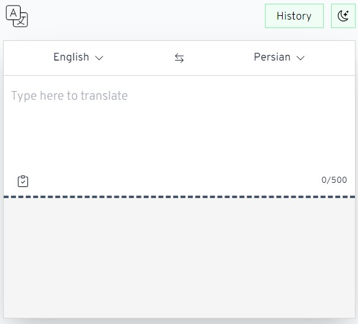

<div align="center">
  <h2>Simple translate web app</h2>
  Check the live demo <a href="https://translate.stonebob.eu.org/">here<br />
  Spotted a bug? No worries, open an issue.
  
</div>

## About the project
This is a simple multilingual translate web app. I made the UI with React and the styling was done with Tailwind. Multiple languages supported for translation by [MyMemory API](https://mymemory.translated.net/) with over twenty speech synthesis languages by [VoiceRSS API](https://voicerss.org/). Translation history is stored in the browser's localStorage.

## Running it locally
1. clone the project:

```bash
git clone git@github.com:Yazdun/react-dictionary-web-app.git
```

2. install the dependencies:

```bash
npm install
```

3. start the local host:

```bash
npm start
```

## Contributing
Although the app is currently working, that doesn't mean it's perfect. Weather a bug fix or a feature, your contributions are very welcome.

1. Fork the Project.
2. Create a branch for your changes:
```bash
git checkout -b your-branch
```
3. Commit your Changes: 
```bash
git commit -m 'fixed the bug x / added feature x'
```

4. Push to the Branch:
```bash
git push origin your-branch
```
5. Open a Pull Request.

Liked the project? give it a star. Thanks a lot!